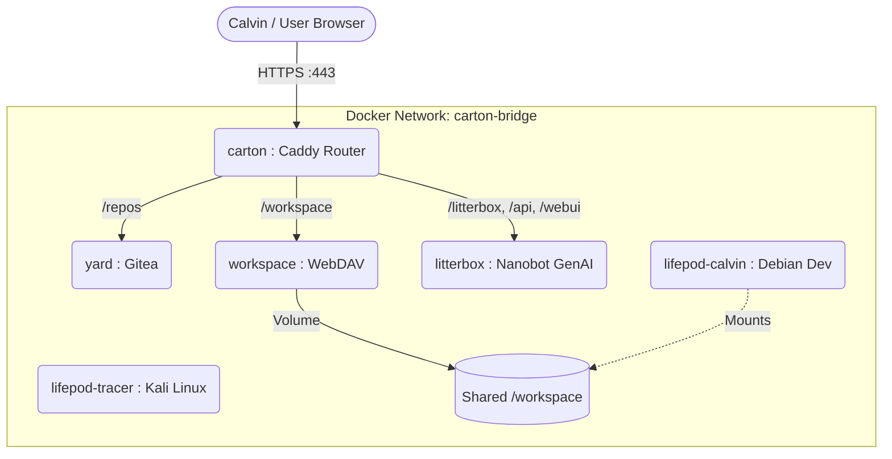

# Cartoniuum Architecture & Lore: The Cardboard Box Computer
**A Guide for Calvin (and the AI Crew) to Remember How We Built This.**

## The Core Concept: Carton vs. Station
The Cartoniuum is built on a "strange loop" philosophy: the infrastructure *is* the repository.

- **The Carton (`~/.carton`)**: Your local development environment. It spins up the exact containers, routing, and tools needed to build the system from within the system.
- **The Station (`~/.station`)**: The production environment. Because the infrastructure is defined strictly in the repository, "deploying to production" simply means cloning the `.carton` repository into `.station`, symlinking the persistent data volumes, and spinning it up.

## The Network Diagram
All modes (containers) are connected via a Docker network bridge called `carton-bridge`. The `carton` mode itself acts as the gateway/router using Caddy, mapping subpaths to the internal containers.

## The Core Modes

All orchestration is managed by the Root `Makefile` which delegates commands down into the mode subdirectories.

1. **`carton`**: The ingress proxy and frontend dashboard. Runs Caddy to route traffic to all other modes safely.
2. **`yard`**: The Gitea forge. Acts as the local "GitHub" for storing Cartoniuum code, allowing the lifepods to push code from within the system back into the system.
3. **`litterbox`**: The Nanobot WebUI GenAI backend. The chat interface for the AI crew.
4. **`workspace`**: A WebDAV server for exposing the file system to external tools (Coming Soon).
5. **`rocket` / `saucer`**: Rapid development sandboxes.

## The Lifepod Architecture
The `lifepod` mode is a special case. Instead of a single container, it is a dynamic sandbox system tailored to individual user profiles (e.g., `calvin`, `roall`, `tracer`).

- **Per-Profile Dockerfiles**: Each user profile gets its own directory (`lifepod/users/<profile>`) containing a custom Dockerfile. If Calvin needs Debian Backports, and Tracer needs Kali Linux, they get their own environments.
- **Host Mounting**: When a lifepod spins up, it mounts `lifepod/users/<profile>` directly into `/home/<profile>` inside the container, preserving bash history, SSH keys, and Git configs on the host.
- **Workspace Access**: The entire `.carton` directory is mounted into the lifepod as `/workspace`, allowing the user to develop the system *from within* the system.

**Spinning up a lifepod:**
`make up MODE=lifepod PROFILE=calvin`
